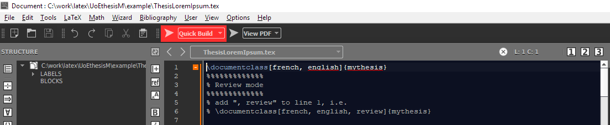

# Table of contents
* [Introduction](#Introduction)
* [Requirements](#Requirements)
* [Installation](#Installation)
* [Configuring TexMaker](#Configuring-TexMaker)
* [Starting a new document](#Starting-a-new-document)
* [Building the document](#Building-the-document)


# Introduction
This repository contains a Latex template for thesis manuscripts.

The template is derived from the template created by [Jean Simard](https://github.com/woshilapin/mytexlive) with his authorisation and help.

The [UoE branch](https://github.com/PierreAlbertPro/mytexlive/tree/UoE) contains the template for the Precision Medicine DTP. It follows the guidelines from the [Standards for the Format and Binding of a Thesis](https://www.ed.ac.uk/files/atoms/files/thesis_signed_declaration.pdf), [as required by the PM DTP](https://www.ed.ac.uk/usher/precision-medicine/information-for-students/programme-requirements/thesis-submission-process-draft/submitting-your-thesis).

This repository is a bunch of various LaTeX packages. Since these are only the sources, they need to be built and put at the right place in order to be used.

The template can be used for two types of documents:
- the manuscript of the thesis itself
- any document required during the PhD: year reports, plans, abstracts, outlines, etc.

Examples are provided in the [example](https://github.com/PierreAlbertPro/mytexlive/tree/UoE/example) folder.


# Requirements
- [python3 (version >= 3)](https://www.python.org/downloads/)
- [Latex, e.g. miktex](https://miktex.org/download)

Latex must be registered in the PATH (this should have been set automatically)


# Installation
To start using this class, it needs to be installed and [built](https://github.com/PierreAlbertPro/mytexlive/tree/UoE##Building-the-packages).

There is 2 ways to install the packages: with `initexmf` or with `texmf`.

## Installation with `initexmf`
You may clone the repository anywhere you want and use the following
command.

```
initexmf --register-root=C:\path\to\your\clone
initexmf --update-fndb
```

## Installation in `texmf`
You can clone the repository directly where LaTeX will see it.

### On Linux
You can usually do the following (`~/texmf` folder is read in most default configurations of
LaTeX).

```
git clone -b UoE --single-branch https://github.com/PierreAlbertPro/mytexlive.git ~/texmf
```

If you want to choose a specific path, you can take a look into the file `web2c/texmf.cnf` from your LaTeX installation and look or change the variable `TEXMFHOME`.

Then finally, reconstruct the index.

```
texhash
```

### On Windows
Clone to the path you want to use

```
git clone -b UoE --single-branch https://github.com/PierreAlbertPro/mytexlive.git "C:\path\to\your\clone"
```

Add the path to LaTeX

```
Using MiKTeX:
Start menu -> MiKTeX -> Maintenance -> settings -> Roots -> Add...
Select the root of your folder, e.g. C:\path\to\your\clone
```

Then finally, reconstruct the index.

```
texhash
```


## Building the packages

### On Windows:
```
cd C:\path\to\your\clone\tex\latex
python3 update.py
```

### On Linux:
```
cd ~/texmf/tex/latex
python3 update.py
```

Note:
Some packages require other packages to be built.
Do [install](https://github.com/PierreAlbertPro/mytexlive/tree/UoE#installation) first then try to [build](https://github.com/PierreAlbertPro/mytexlive/tree/UoE##Building-the-packages).
After installation and build, you'll probably need a last update of the LaTeX packages database (`texhash` or `initexmf --update-fndb`).


# Updating
If the template has been updated, you do not need to install it again. Simply retrieve it and build it again.

The last version can be retrieved using the following steps:
- move to the folder of the template, e.g. 
```
cd C:\path\to\your\clone
```
- retrieve the last version:
```
git pull
```
- update your local template:
```
cd tex/latex
python3 update.py
```

# Configuring TexMaker
TexMaker should be properly configured except for the creation of the glossary:
```
Under User -> User commands -> edit user command
Select command 1
Menu item: makeglossaries
Command: makeglossaries %
```

If any error occurs, make sure the following options are correct:
```
Options -> configure TexMaker
Under Commands, make sure the Bib(la)tex command refers to biber, e.g. "C:/Program Files/MiKTeX 2.9/miktex/bin/x64/biber.exe" %.bcf
```
```
Options -> configure TexMaker
Make sure PdfLaTex + bib(la)tex + PdfLaTex (x2) + View Pdf is selected
```


# Starting a new document
The only requirement is to fill in EITHER Document related information OR Thesis information:
- Thesis: 
```
\presentationyear{2020}
\grade{Doctor of Philosophy in Precision Medicine}
```
- Document:
```
\docswitch{document}
\date{\mydate[datestyle=short]{2019-06-20}}
\subtitle{Abstract}
```

# Building the document
To generate the PDF of the document:
In `TexMaker`, press the build button



If new terms need to be added to the glossary or list of accronyms, run `makeglossaries` (press alt+shift+F1), then build the document again.